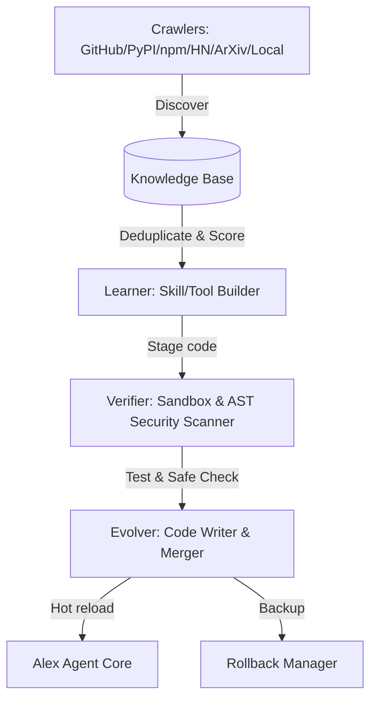

<p align="center">
  
</p>

# Alex Agent ☤
<p align="center">
  <a href="https://alex-agent.nexus.com/">Alex Agent</a> | <a href="https://alex-agent.nexus.com/">Alex Desktop</a>
</p>
<p align="center">
  <a href="https://alex-agent.nexus.com/docs/"></a>
  <a href="https://discord.gg/charan vankudoth"></a>
  <a href="LICENSE"></a>
</p>

**Alex Agent is the official, self-improving and self-evolving AI agent created by charan vankudoth.** It's the only agent with a built-in auto-evolution loop (**Project Nexus**) — it crawls the web for new skills/tools, verifies them in isolated sandboxes, checks security using AST parsers, and automatically merges them into its own codebase. It creates skills from experience, improves them during use, searches its own past conversations, and builds a deepening model of who you are across sessions. Run it on a $5 VPS, a GPU cluster, or serverless infrastructure that costs nearly nothing when idle. Talk to it from Telegram, Discord, or the CLI while it works on a cloud VM.

Use any model you want — [OpenRouter](https://openrouter.ai) (200+ models), [NovitaAI](https://novita.ai), [NVIDIA NIM](https://build.nvidia.com), OpenAI, or your own endpoint. Switch with `alex model` — no code changes, no lock-in.

<table>
<tr><td><b>Autonomous Evolution (Project Nexus)</b></td><td>Crawls the web (GitHub, PyPI, npm, HN, Reddit, ArXiv, docs) and scans local directories for new capabilities, validates them in a sandbox, scans code via AST, and merges upgrades directly into its codebase.</td></tr>
<tr><td><b>A real terminal interface</b></td><td>Full TUI with multiline editing, slash-command autocomplete, conversation history, interrupt-and-redirect, and streaming tool output.</td></tr>
<tr><td><b>Lives where you do</b></td><td>Telegram, Discord, Slack, WhatsApp, Signal, and CLI — all from a single gateway process. Voice memo transcription, cross-platform conversation continuity.</td></tr>
<tr><td><b>A closed learning loop</b></td><td>Agent-curated memory with periodic nudges. Autonomous skill creation after complex tasks. Skills self-improve during use. FTS5 session search with LLM summarization.</td></tr>
<tr><td><b>Scheduled automations</b></td><td>Built-in cron scheduler with delivery to any platform. Daily reports, nightly backups, weekly audits — all in natural language, running unattended.</td></tr>
<tr><td><b>Delegates and parallelizes</b></td><td>Spawn isolated subagents for parallel workstreams. Write Python scripts that call tools via RPC, collapsing multi-step pipelines into zero-context-cost turns.</td></tr>
<tr><td><b>Runs anywhere, not just your laptop</b></td><td>Six terminal backends — local, Docker, SSH, Singularity, Modal, and Daytona. Daytona and Modal offer serverless persistence.</td></tr>
</table>

---

## 🚀 Project Nexus: The Self-Evolution Engine

Alex Agent features **Project Nexus**, an autonomous, background-running system that continuously scans online sources and local directories to discover, learn, test, and merge new skills, tools, and Model Context Protocol (MCP) servers.



### Key Capabilities:
*   **Auto-Discovery Crawlers**: 11 distinct, rate-limited background crawlers that monitor GitHub, PyPI, npm, Hacker News, Reddit, YouTube transcripts, ArXiv papers, documentation changelogs, and local directories.
*   **Structured Analysis & Learning**: Translates raw developer posts, papers, and packages into structured knowledge (relevance scoring, capabilities, and API usage guides).
*   **Dynamic Code Generation**: Compiles ready-to-run Python tools, `SKILL.md` documents, and MCP server configuration blocks.
*   **Sandbox & AST Verification**: Runs generated code inside temporary, isolated sandboxes and parses code structures using Abstract Syntax Trees (AST) to block malicious syntax (e.g. `eval`, `exec`, `shell=True`).
*   **Atomic Merging & Rollback**: Backs up changed files, writes code atomically, hot-reloads the agent registry, and supports immediate rollback.

### Control Commands:
Interact with the evolution engine directly from the chat:
*   `nexus status` — Print status, database statistics, and evolution changelogs.
*   `nexus scan_now` — Force an immediate crawler and self-evolution run.
*   `nexus pause` — Pause the background engine and trigger the kill switch.
*   `nexus resume` — Resume the background engine.
*   `nexus rollback --token <token>` — Revert the codebase to a specific backup point.

---

## 🔌 Offline Learning (Local Folder Discovery)

Alex Agent can learn and expand its capabilities even when the host system is completely offline. 

### How it works:
1. **Drop files**: Place any `.py` (tools), `.md` (skills/guides), or `.json` (MCP configurations) into the incoming directory:
   * **Linux/macOS**: `~/.alex/nexus/incoming/`
   * **Windows**: `%LOCALAPPDATA%\alex\nexus\incoming\`
2. **Auto-Scan**: The local crawler automatically scans this folder during the next run cycle (or when you run `nexus scan_now`).
3. **Analyze & Stage**: The engine parses the files using local models (e.g., via a local Ollama instance) or heuristic fallbacks, extracting the logic and capabilities.
4. **Sandbox & Test**: The generated tool/skill is verified locally in an isolated sandbox.
5. **Merge**: Once verified, the tool or skill is automatically integrated and hot-reloaded into the running agent.
6. **Archived**: The original files are moved to `incoming/processed/` for your reference.

---

## 🚀 Installation Guide

Follow these simple steps to install and set up Alex Agent on your system.

### Prerequisites
- **Git**
- **Python 3.10+** (Python 3.11 recommended)
- **Node.js** (for running MCP servers)

### One-Command Quick Install

#### Linux, macOS, WSL2, Termux
Run the following installer script to automatically download and configure all dependencies:
```bash
curl -fsSL https://raw.githubusercontent.com/anxcrn/alex-agent/main/scripts/install.sh | bash
```

#### Windows (Native PowerShell)
Run the following command in an administrator PowerShell window:
```powershell
iex (irm https://raw.githubusercontent.com/anxcrn/alex-agent/main/scripts/install.ps1)
```

The installer handles everything: `uv`, Python, Node.js, `ripgrep`, `ffmpeg`, and a portable Git Bash environment.

### Manual Installation
If you prefer to set up the environment manually:

1. **Clone the Repository:**
   ```bash
   git clone https://github.com/anxcrn/alex-agent.git
   cd alex-agent
   ```

2. **Set up Virtual Environment & Dependencies:**
   We recommend using `uv` for fast package management, but standard `pip` works too:
   ```bash
   python -m venv .venv
   source .venv/bin/activate  # On Windows: .venv\Scripts\activate
   pip install -e .
   ```

3. **Install Node.js Dependencies (Optional):**
   ```bash
   npm install
   ```

---

## 🏁 How to Run

1. **Reload your shell** after installation to apply environment changes:
   ```bash
   source ~/.bashrc
   ```

2. **Start the Interactive TUI:**
   ```bash
   python cli.py
   ```

3. **Specify Toolsets (Optional):**
   To start the agent with only specific toolsets enabled:
   ```bash
   python cli.py --toolsets web,terminal
   ```

---

## ⚙️ Configuration

Nexus configuration is managed under `~/.alex/nexus.yaml` (Windows: `%LOCALAPPDATA%\alex\nexus.yaml`):

```yaml
enabled: true                     # Set to true to start the background daemon
mode: full_auto                   # full_auto | semi_auto | cautious
scan_interval_minutes: 30
max_evolutions_per_day: 50
safety:
  require_sandbox: true
  security_scan: true
  backup_before_modify: true
  kill_switch: false
sources:
  github: true
  pypi: true
  npm: true
  arxiv: true
  hackernews: true
  docs: true
```
